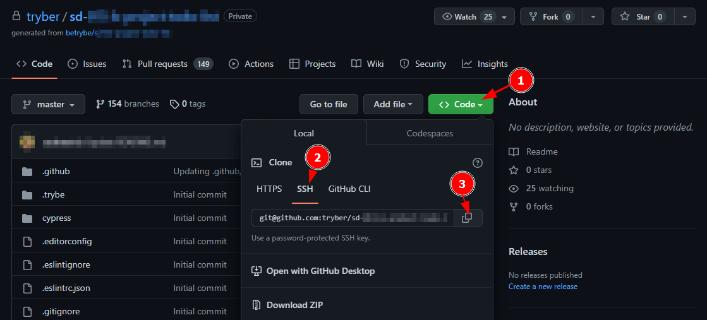
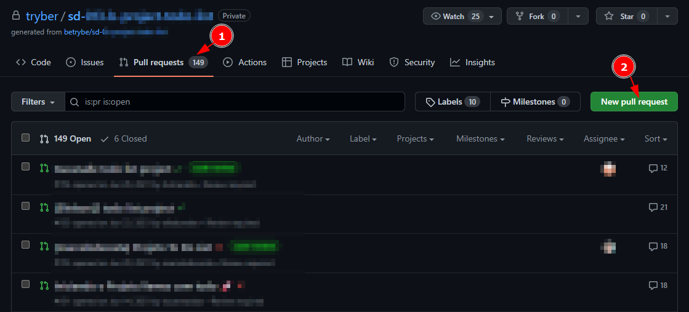

# Sistema de Votação

Boas-vindas ao repositório Sistema de Votação.

Para o desenvolvimento desta atividade, siga atentamente cada um dos passos descritos a seguir.

Neste _README_ você encontrará orientações sobre como estruturar o desenvolvimento do seu projeto a partir deste repositório, utilizando uma _branch_ específica e criando um _Pull Request_ (PR) para seus códigos.

## 🧑‍💻 O que deverá ser desenvolvido

Com as habilidades adquiridas em Java, surgiu para você um novo desafio: desenvolver um sistema de votação eletrônico! É isso mesmo, você será o grande arquiteto digital da democracia!

Imagine só: seu sistema deve possibilitar o cadastro de todas as nossas pessoas candidatas e eleitoras, além de coordenar todo o processo de votação. E tem mais, você será capaz de verificar os resultados da eleição a qualquer momento.

Durante o seu desenvolvimento você deverá seguir quatro etapas essenciais:

1. Cadastrar pessoas candidatas
2. Cadastrar pessoas eleitoras
3. Iniciar processo votação
4. Apresentar os resultados da eleição

O objetivo deste projeto é praticar a lógica de programação em um contexto de programação orientada a objetos e entender como esses conceitos permitem que escrevamos código mais claro, mais flexível e mais fácil de manter.

## Como Desenvolver

<details>
<summary><strong>🤷🏽‍♀️ Como corrigir automaticamente?</strong></summary>

Para que o avaliador automático revise seu projeto, será necessário criar um _Pull Request_ neste repositório.

</details>
  
<details>
  <summary><strong>Habilidades a serem trabalhadas</strong></summary>

Neste projeto, verificamos se você é capaz de:

1. Compreender os conceitos fundamentais da Programação Orientada a Objetos (POO) e como a linguagem Java aplica esses conceitos.
2. Entender a importância de conceitos como classes, objetos, métodos, encapsulamento, herança, polimorfismo, interfaces e classes abstratas na POO.
3. Aplicar os conceitos de POO na prática, através da codificação em Java.
4. Analisar códigos Java escritos por outros, identificando o uso de conceitos de POO e entendendo como eles contribuem para a organização e clareza do código.
5. Criar novos programas Java utilizando os conceitos de POO, organizando o código de maneira lógica e eficiente.
6. Avaliar a eficácia de diferentes abordagens de programação em Java, considerando fatores como legibilidade, eficiência e facilidade de manutenção.

Desta forma, o projeto visa desenvolver as habilidades de programação orientada a objetos dos participantes, desde o nível de conhecimento até a capacidade de avaliar e criar seus próprios códigos em Java.

</details>

<details>
<summary>‼️ Antes de começar a desenvolver</summary>

1. Clone o repositório.

   - Copie o endereço SSH do repositório e use-o para cloná-lo em sua máquina:
     - Por exemplo: `git clone git@github.com:tryber/xxxx.git`.

     <details><summary>🖼️ Local do endereço SSH na página inicial do repositório:</summary>

     

     </details>
   - Entre no diretório do repositório que você acabou de clonar:
     - `cd <diretório-do-repo>`

2. Crie uma _branch_ a partir da branch `main`.

   - Certifique-se de que você está na branch `main`.
     - Exemplo: `git branch`
   - Caso não esteja, mude para a branch `main`.
     - Exemplo: `git checkout main`
   - Agora, crie uma nova branch à qual você irá submeter os `commits` do seu desenvolvimento.
     - Exemplo: `git checkout -B joãozinho-xxx`

3. Para cada etapa do desenvolvimento, adicione as mudanças ao _stage_ do Git e faça um `commit`.

   - Note que as mudanças ainda não estão no _stage_.
     - Exemplo: `git status` (as alterações realizadas devem estar destacadas em vermelho).
   - Adicione o novo arquivo ao _stage_ do Git.
     - Exemplo:
       - `git add .` (adicionando todas as mudanças - _que estavam em vermelho_ - ao stage do Git)
       - `git status` (as alterações realizadas devem estar destacadas em verde)
   - Faça o `commit` inicial.
     - Exemplo:
       - `git commit -m 'Iniciando o desenvolvimento X! #VQV 🚀'` (fazendo o primeiro commit)
       - `git status` (uma mensagem semelhante a _nothing to commit_ deve aparecer)

4. Adicione sua branch com o novo `commit` ao repositório remoto.

   - Usando o exemplo anterior: `git push -u origin joãozinho-sd-0x-project-x`

5. Crie um novo _`Pull Request`_.

   - Vá à página de _Pull Requests_ do repositório no GitHub.
      <details><summary>🖼️ Local da página de Pull Requests no repositório:</summary>

     

     </details>
   - Clique no botão verde _"New pull request"_.
   - Clique na caixa de seleção _"Compare"_ e escolha sua branch **com atenção**.
   - Clique no botão verde _"Create pull request"_.
   - Adicione uma descrição ao _Pull Request_ e clique no botão verde _"Create pull request"_.
   - **Não se preocupe em preencher nada mais por enquanto!**
   - Volte à página de _Pull Requests_ do repositório e verifique se o seu _Pull Request_ foi criado.

</details>

<details>
<summary>⌨️ Durante o desenvolvimento</summary>

- Faça `commits` regulares das alterações que você fizer no código.

- Lembre-se de sempre atualizar o repositório remoto após um ou mais `commits`. 

- Os comandos que você utilizará com mais frequência são:
    1. `git status` _(para verificar o que está em vermelho - fora do stage - e o que está em verde - no stage)_
    2. `git add` _(para adicionar arquivos ao stage do Git)_
    3. `git commit` _(para criar um commit com os arquivos que estão no stage do Git)_
    4. `git push -u nome-da-branch` _(para enviar o commit para o repositório remoto na primeira vez que fizer o `push` de uma nova branch)_
    5. `git push` _(para enviar o commit ao repositório remoto após o passo anterior)_

</details>

## Orientações


<details>
<summary><strong>🎛 Checkstyle</strong></summary>

Para garantir a qualidade do código, vamos utilizar neste projeto o `Checkstyle`. Assim o código estará alinhado com as boas práticas de desenvolvimento, sendo mais legível e de fácil manutenção! Para poder rodar o `Checkstyle` certifique-se de ter executado o comando `mvn install` dentro do repositório.

Para rodá-los localmente no repositório, execute os comandos abaixo:

```bash
mvn checkstyle:check
```

Se a análise do `Checkstyle` encontrar problemas no seu código, tais problemas serão mostrados no seu terminal. Se não houver problema no seu código, nada será impresso no seu terminal.

Você pode também instalar o plugin do `Checkstyle` na sua `IDE`. Para isso, volte na primeira seção do conteúdo.

</details>

<details>
<summary><strong>🛠 Testes</strong></summary>


Para executar todos os testes basta rodar o comando:
```bash
mvn test
```

Para executar apenas uma classe de testes:
```bash
mvn test -Dtest="TestClassName"
```

### Executando os testes no avaliador

  Os testes do avaliador serão executados automaticamente quando você fizer um `push` em sua branch, desde que um _Pull Request_ tenha sido criado. O processo de avaliação pode levar algum tempo, mas assim que for concluído, você verá um comentário com os resultados dos testes em seu PR.

  > **Atenção ⚠️: o avaliador automático pode não avaliar seu projeto na ordem em que os requisitos aparecem no _README_. Isso é feito para agilizar o processo de avaliação. Portanto, não se preocupe se isso ocorrer.**

</details>

## Requisitos

## 1 - Implemente a classe abstrata Pessoa

<details>
    <summary>Implemente a classe abstrata Pessoa, criando os atributos, getters e setters</summary>


No projeto já existe um arquivo com a classe `com.betrybe.sistemadevotacao.Pessoa`. Nessa classe, você deve garantir que: 
 1. Ela é uma classe abstrata, de forma que ela será utilizada como base para implementação de outras classes, mas não será instanciada por si.
 2. Ela possui o atributo protegido `nome` do tipo String.
 3. Ela possui os _getters_ e _setters_ correspondentes ao atributo.
  - Note que estes métodos não são abstratos, mesmo que a classe seja.

</details>

---
## 2 - Implemente a classe PessoaCandidata

<details>
    <summary>Implemente a classe PessoaCandidata, incluindo atributos, métodos e herança </summary>

A classe `PessoaCandidata` herda da classe `Pessoa`, ficando responsável por representar a pessoa candidata. Essa classe é formada por:
1. Atributos:
    - `nome`: herdado da classe `Pessoa`;
    - `numero`: atributo do tipo **primitivo** inteiro que armazena o número identificador para voto;
    - `votos`: atributo do tipo **primitivo** inteiro que armazena o número de votos recebidos pela pessoa candidata.
2. Métodos:

   Como o atributo nome será herdado da classe Pessoa, não é necessário implementar os métodos getter e setter para ele na subclasse;
   - implemente os getters e setters referentes ao atributo `numero`.

    O atributo `votos` deve possuir um método getter, mas não deve ser acompanhado por um método setter,
preservando assim a integridade do número de votos. Em vez de um setter, deve existir um método adicional 
nomeado `receberVoto`.

   - Este método `receberVoto` será responsável por incrementar em 1 o valor do atributo votos, representando 
assim o recebimento de voto pela pessoa candidata. Este método não terá retorno.

3. Construtor: 

    O construtor da classe deverá aceitar dois parâmetros: `nome` e `numero`, que serão armazenados nos atributos correspondentes da instância criada. Além disso, 
o atributo `votos` deverá ser inicializado no construtor com o valor zero sempre que uma nova instância for criada.

Note que todos os métodos da classe em questão são públicos.

</details>

---
## 3 - Implemente a classe PessoaEleitora

<details>
    <summary>Implemente a classe PessoaEleitora</summary>

A classe `PessoaEleitora` herda da classe `Pessoa`, ficando responsável por representar a pessoa eleitora. Garanta que:
1. Além do(s) atributo(s) herdado(s), ela deve possuir um atributo privado adicional `cpf` do tipo String, que armazena o CPF da pessoa eleitora. 
2. A classe deve possuir os _getters_ e _setters_ correspondentes aos atributos.

Note que todos os métodos dessa classe são públicos.

</details>

---
## 4 - Implementar a classe GerenciamentoVotacao com atributos

<details>
    <summary>Implemente a classe que fará o gerenciamento do processo de votação e seus atributos</summary>

Neste requisito, você deve iniciar a implementação da classe `GerenciamentoVotacao` que é responsável por gerenciar a votação e o cadastro de pessoas candidatas e pessoas eleitoras. A classe deve implementar a interface `GerenciamentoVotacaoInterface`, já disponibilizada com o projeto.

Por enquanto você não precisa completar os métodos da interface, apenas deverá criar três atributos privados:
- `pessoasCandidatas`: responsável por manter uma lista das pessoas candidatas cadastradas, ou seja, de objetos instanciados da classe `PessoaCandidata`;
- `pessoasEleitoras`: responsável por manter uma lista das pessoas eleitoras cadastradas, ou seja, de objetos instanciados da classe `PessoaEleitora`;
- `cpfsComputados`: responsável por manter uma lista com os CPFs das pessoas eleitoras que já votaram, ou seja, de Strings.

Para criar os três atributos acima, você deve utilizar a classe `ArrayList`. Nós aprenderemos mais sobre essa classe posteriormente, mas utilizaremos essa classe aqui porque ela pode receber novos objetos de uma forma mais simples e eficiente do que com os _arrays_ nativos do Java. Um exemplo de uso:

```java
ArrayList<String> fruits = new ArrayList<String>();
fruits.add("maça");
fruits.add("uva");
System.out.println(fruits.get(1)); // Imprime "uva"
```

Para mais informações, você pode consultar o site da [W3Schools](https://www.w3schools.com/java/java_arraylist.asp), ou a [documentação](https://docs.oracle.com/en/java/javase/17/docs/api/java.base/java/util/ArrayList.html) oficial.

</details>

---
## 5 - Implementar os métodos de cadastro da classe GerenciamentoVotacao

<details>
    <summary>Implemente os métodos de cadastro da classe GerenciamentoVotacao</summary>

Neste requisito, você deve implementar os métodos da classe `GerenciamentoVotacao` referentes a cadastro, conforme abaixo:

- **Método** `cadastrarPessoaCandidata`: esse método público deve receber dois parâmetros: o `nome` (String) e o `numero` (inteiro) da pessoa candidata. Neste método você deve:
   - Verificar se o número da pessoa candidata já está cadastrado na lista `pessoasCandidatas` e, caso esteja, imprimir a mensagem `Número da pessoa candidata já utilizado!` no console;
   - Caso contrário, instanciar um objeto da classe `PessoaCandidata` utilizando os valores recebidos;
   - Por fim, adicionar o novo objeto na lista `pessoasCandidatas` (Dica: utilize o método `.add` da classe `ArrayList`).
- **Método** `cadastrarPessoaEleitora`: esse método público deve receber dois parâmetros: o `nome` (String) e o `cpf` (String) da pessoa candidata. Neste método você deve:
    - Verificar se o CPF da pessoa já está cadastrado na lista `pessoasEleitoras` e, caso esteja, imprimir a mensagem `Pessoa eleitora já cadastrada!` no console;
    - Caso contrário, instanciar um objeto da classe `PessoaEleitora` utilizando os valores recebidos
    - Por fim, adicionar o novo objeto na lista `pessoasEleitoras`.

</details>

---
## 6 - Implementar os métodos de votação da classe GerenciamentoVotacao

<details>
    <summary>Implemente os métodos de votação da classe GerenciamentoVotacao</summary>

Neste requisito, você deve implementar os métodos da classe `GerenciamentoVotacao` referentes à votação, conforme abaixo:

- **Método** `votar`: esse método público deve receber dois parâmetros: o `cpfPessoaEleitora` e o `numeroPessoaCandidata`. Nesse método você deve:
   - Verificar se o CPF da pessoa eleitora já está inserido na lista `cpfsComputados` e, caso esteja, deve imprimir a mensagem `Pessoa eleitora já votou!` no console;
   - Caso contrário, deve percorrer o array `pessoasCandidatas` para encontrar o objeto da pessoa candidata que tenha o número passado pelo parâmetro `numeroPessoaCandidata`. Quando encontrar o objeto que representa a pessoa candidata, deverá chamar o método `receberVoto` desse objeto.
   - Por fim, deve inserir o CPF da pessoa eleitora na lista `cpfsComputados`, de forma que essa pessoa eleitora não possa votar novamente 
- **Método** `mostrarResultado`: esse método público é responsável por imprimir no console o resultado da eleição, seja o resultado parcial ou o final. Ele não recebe nenhum parâmetro. No método, você deve:
   - Verificar se já existe algum voto computado e, caso não, mostrar a mensagem `É preciso ter pelo menos um voto para mostrar o resultado.`. Você pode utilizar a lista de CPFs para verificar o total de votos.
   - Caso já tenha votos computados, imprimir no console o nome de cada pessoas candidata com a quantidade de votos que ela recebeu e o percentual de votos recebidos. Além disso, mostrar o total de votos computados. Exemplo de saída:
```text
Nome: Maria - 2 votos ( 67% )
Nome: José - 1 votos ( 33% )
Total de votos: 3
```

Nota: no cálculo da porcentagem, arredonde o valor para inteiro utilizando o método estático `round` da classe `Math` do Java.

</details>

---
## 7 - Implementar a classe Principal

<details>
    <summary>Implementar a classe Principal, responsável por interagir com a pessoa usuária</summary>

Neste requisito você irá implementar a classe `Principal`, que fará a execução de todo o processo de cadastro e votação.

Será preciso criar um menu com três etapas:
- Cadastro de pessoas candidata;
- Cadastro de pessoas eleitoras;
- Votação.

Para implementar o sistema, a classe `Principal` deve conter o método `main`, que utilizará a classe `GerenciamentoVotacao` para realizar as diferentes etapas.

Você poderá utilizar laços de repetição para processar cada etapa.

### Cadastro de pessoas candidatas

O menu de cadastro de pessoas candidatas deverá ter o seguinte formado:

```text
Cadastrar pessoa candidata?
1 - Sim
2 - Não
Entre com o número correspondente à opção desejada:
```

Se a pessoa usuária entrar com o valor 1 (que indica que ela quer cadastrar uma pessoa candidata), a mensagem `Entre com o nome da pessoa candidata:` deverá ser impressa no console.

Em seguida, após inserir o nome da pessoa candidata e pressionar enter, aparecerá a mensagem `Entre com o número da pessoa candidata:` no console. Depois que a pessoa usuária inserir o número da pessoa candidata, o sistema deverá retornar ao estado inicial do menu. 

Supondo que o nome da primeira pessoa candidata seja "Maria" e o seu número para votar seja "1", então um exemplo do conteúdo do console depois de cadastrar a primeira pessoa candidata será:

```text
Cadastrar pessoa candidata?
1 - Sim
2 - Não
Entre com o número correspondente à opção desejada:
1
Entre com o nome da pessoa candidata:
Maria
Entre com o número da pessoa candidata:
1
Cadastrar pessoa candidata?
1 - Sim
2 - Não
Entre com o número correspondente à opção desejada:
```

Esse ciclo se repete até não haver mais pessoas candidatas para serem cadastradas. Quando isso acontecer, a pessoa usuária entrará com a opção 2 do menu, o que vai parar o primeiro laço. O segundo laço, que representa a etapa de cadastro de pessoas eleitoras, deve ser iniciado logo na sequência.

⚠️🔴**IMPORTANTE: para facilitar o uso da classe `Scanner` do Java, cadastra-se apenas o primeiro nome da pessoa candidata — ou seja, Maria, e não Maria Silva ou Maria Clara.** 🔴⚠️

### Cadastro de pessoas candidatas

Após finalizar o cadastro de pessoas candidatas, passamos para o cadastro de pessoas eleitoras. O menu deverá ter o seguinte formato:

```text
Cadastrar pessoa eleitora?
1 - Sim
2 - Não
Entre com o número correspondente à opção desejada:
```

Se a pessoa usuária entrar com o valor 1 (que indica que ela quer cadastrar uma pessoa eleitora), então a mensagem `Entre com o nome da pessoa eleitora:` será impressa no console. Em seguida, depois de inserir o nome da pessoa eleitora e pressionar enter, aparecerá no console a mensagem `Entre com o CPF da pessoa eleitora:`.

Depois que a pessoa usuária inserir o CPF da pessoa eleitora, o sistema deve retornar ao estado inicial do menu. Supondo que o nome da primeira pessoa eleitora seja "João", portador do CPF "123.456.789-00", um exemplo do conteúdo do console após cadastrá-la será:

```text
Cadastrar pessoa eleitora?
1 - Sim
2 - Não
Entre com o número correspondente à opção desejada:
1
Entre com o nome da pessoa eleitora:
João
Entre com o cpf da pessoa eleitora:
123.456.789-00
Cadastrar pessoa eleitora?
1 - Sim
2 - Não
Entre com o número correspondente à opção desejada:
 ```

Esse ciclo se repete até o esgotamento das pessoas eleitoras a serem cadastradas. Ao final desse cadastro, a pessoa usuária entrará com a opção 2 do menu, o que vai parar o segundo laço e iniciar o terceiro, marcando o início da votação.

### Votação

Após finalizar o cadastro de pessoas eleitoras, entramos na etapa de votação. O menu deve ter o seguinte formato:

```text
 Entre com o número correspondente à opção desejada:
 1 - Votar
 2 - Resultado Parcial
 3 - Finalizar Votação
```

Se a pessoa usuária entrar com o valor 1 (que indica que ela quer computar um voto), a mensagem `Entre com o cpf da pessoa eleitora:` deverá ser impressa no console. Em seguida, após inserir o CPF da pessoa eleitora e pressionar enter, deverá aparecer a mensagem `Entre com o número da pessoa candidata:` no console. Feito isso, o voto deve ser computado, e o sistema retorna ao estado inicial do menu. Supondo que o CPF da primeira pessoa eleitora seja "123.456.789-00", e o número da pessoa candidata seja 1, então um exemplo do conteúdo do console após realizar um voto será:

```text
 Entre com o número correspondente à opção desejada:
 1 - Votar
 2 - Resultado Parcial
 3 - Finalizar Votação
 1
 Entre com o cpf da pessoa eleitora:
123.456.789-00
 Entre com o número da pessoa candidata:
 1
 Entre com o número correspondente à opção desejada:
 1 - Votar
 2 - Resultado Parcial
 3 - Finalizar Votação
```

Se a pessoa escolher a opção 2 ("Resultado parcial"), o resultado parcial deverá ser mostrado, mas a votação continua. Já se a pessoa escolher a opção 3, deverá ser mostrado o resultado final, e a execução termina.

</details>